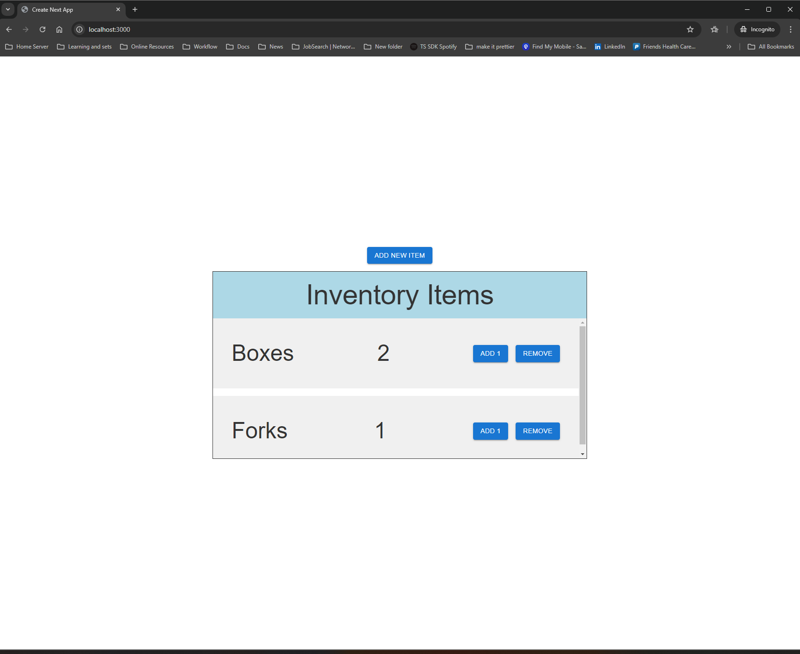

# Inventory Management App

## Table of Contents

- [Description](#description)
- [Installation](#installation)
- [Usage](#usage)
- [Learn More](#learn-more)
- [Deploy to Vercel](#deploy-on-vercel)
- [Contributing](#contributing)
- [License](#license)

## Description

This is an inventory management application creating using next.js and Google's [Firebase](https://firebase.google.com/).



## Installation

1. Clone the repository:
    ```bash
    git clone https://github.com/yourusername/your-repo.git
    cd your-repo
    ```

2. Install dependencies:
    ```bash
    npm install
    ```

## Usage

1. Go to [firebase](https://firebase.google.com/) and create a project.
2. create an app and Firestore Database
3. Fill out to environment variables in .env.local (The expected variables are listed under example.env.local)
4. Confirm that it is working by running the development server locally:

  ```bash
  npm run dev
  ```

5. Build the production deployment:

```bash
npm run build
```

6. Run the deployment:

```bash
npm run start
```

## Learn More

To learn more about Next.js, take a look at the following resources:

- [Next.js Documentation](https://nextjs.org/docs) - learn about Next.js features and API.
- [Learn Next.js](https://nextjs.org/learn) - an interactive Next.js tutorial.

You can check out [the Next.js GitHub repository](https://github.com/vercel/next.js/) - your feedback and contributions are welcome!

## Deploy on Vercel

1. Sign up for a [Vercel](https://vercel.com/) account if you don't have one.
2. Connect your GitHub repository to Vercel.
3. Deploy your project by following the instructions on Vercel.

## Contributing

To contribute to the inventory management application, please follow these steps:

1. Fork the repository and clone it to your local machine.
2. Create a new branch for your changes:
  ```bash
  git checkout -b feature/your-feature-name
  ```
3. Make your desired changes to the codebase.
4. Test your changes locally to ensure they work as expected.
5. Commit your changes with a descriptive commit message in past tense:
  ```bash
  git commit -m "Added feature/fix: Description of your changes"
  ```
6. Push your changes to your forked repository:
  ```bash
  git push origin feature/your-feature-name
  ```
7. Open a pull request on the original repository, explaining your changes and why they should be merged.

Thank you for contributing to the inventory management application!

## License

This project is licensed under the MIT License - see the [LICENSE](LICENSE) file for details.
